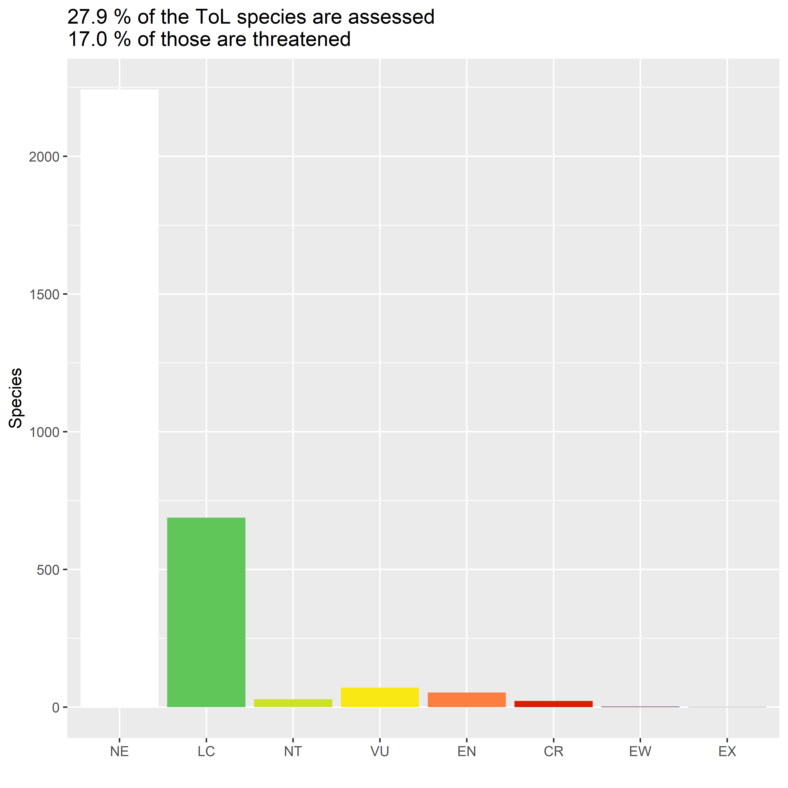
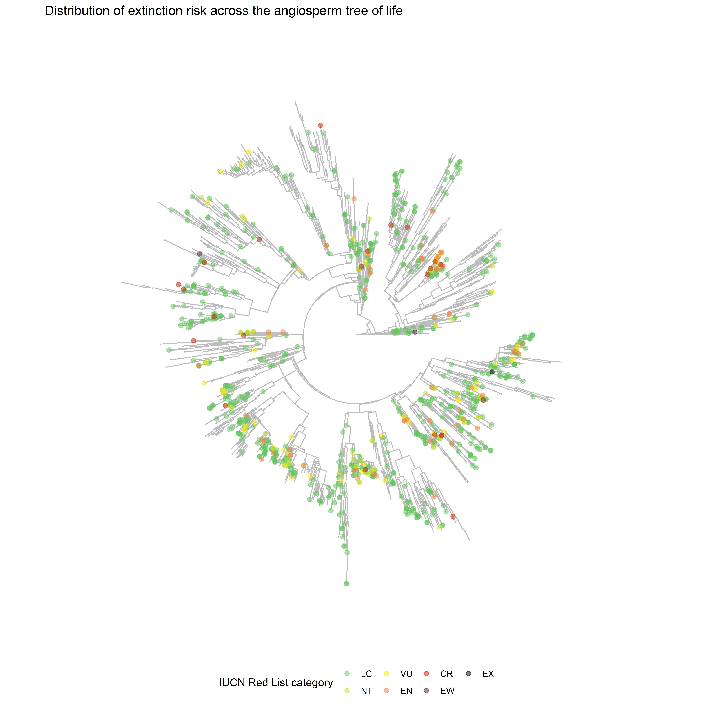

Kew's Tree of Life let's us search, download, and view data related to their efforts towards building a Tree of Life for all plant and fungal genera. The most recent release focuses on a Tree of Life for angiosperm genera. This article is a small demonstration of how to view the tree and incorporate some extra data onto it.

To do this, we will:

1. Get assessment information for all angiosperm species listed on the IUCN Red List of Threatened Species.
2. Match those names to an IPNI ID using the Kew Names Matching Service.
3. Resolve assessments to accepted names using the World Checklist of Vascular Plants.
4. Match assessment categories to species names in the Tree of Life.
5. Plot the Tree of Life with an indication of the threat level for each species.

All the species names in the Tree of Life have been aligned to the World Checklist of Vascular Plants (WCVP), so a large part of this article will be getting the IUCN Red List assessments to match that taxonomy too.

## Setup

In addition to *kewr*, we'll load:

* *dplyr* to manipulate the data
* *tidyr* to reshape data frames
* *purrr* to map functions across data
* *tidylog* to print diagnostic information about data joins
* *stringr* to extract some data from strings
* *glue* to format strings
* *ape* to parse our tree data
* *ggplot2* to make some plots of our final data
* *ggtree* to visualise our tree


```r
library(kewr)
library(dplyr)
library(tidyr)
library(purrr)
library(stringr)
library(glue)
library(ape)
library(ggplot2)
library(ggtree)
```

## 1. Getting assessment information

I've already downloaded all assessments from the IUCN Red List and filtered them down to just assessments for angiosperms.

You can do the same by [installing the *rredlist* package](https://github.com/ropensci/rredlist). You'll need an API key to use the IUCN Red List API, which you can [register for here](https://apiv3.iucnredlist.org/api/v3/token). Alternatively, you can download the information you need directly from [the IUCN Red List website](https://www.iucnredlist.org/).

I bundled these assessments up in this package to make things a bit easier for analysis.


```r
head(angiosperm_assessments)
#> # A tibble: 6 x 4
#>   taxonid scientific_name    taxonomic_autho~ category
#>     <int> <chr>              <chr>            <chr>   
#> 1   30310 Cotoneaster grana~ Boiss.           LR/cd   
#> 2   30312 Liquidambar orien~ <NA>             VU      
#> 3   30314 Prunus ramburii    Boiss.           VU      
#> 4   30315 Rhamnus intermedia Steud. &amp; Ho~ LC      
#> 5   30316 Rhamnus persicifo~ Moris            EN      
#> 6   30317 Salix tarraconens~ Pau              VU
```

In total, there are assessments for 53,542 angiosperm assessments.

## 2. Match names to an IPNI ID

Now we need to match these names to an IPNI ID, so we can check the accepted names for them in WCVP. There are a fair number of species names we need to match, so this might take a while to run.

To match these names to an IPNI ID, we'll use the Kew Names Matching Service. The first thing we'll do, is join the taxonomic authority to the scientific name, to hopefully reduce the number of matches for each name.


```r
angiosperm_assessments <-
  angiosperm_assessments %>%
  unite("full_name", scientific_name, taxonomic_authority, sep=" ", remove=FALSE)
```

Then we put the full names through KNMS. We have too many names to put through KNMS at once, so we'll split them up into smaller chunks that we can put through one after the other. *You might need to re-run this a couple of times until it works, as KNMS can get upset sometimes.*


```r
chunk_size <- 5000
chunk_idx <- ceiling(
  seq(1, nrow(angiosperm_assessments)) / chunk_size
)

chunked_names <- split(angiosperm_assessments$full_name, chunk_idx)

full_matches <- map(chunked_names, ~match_knms(.x))

list(
  matched=sum(map_dbl(full_matches, ~.x$matched)),
  unmatched=sum(map_dbl(full_matches, ~.x$unmatched)),
  multiple_matches=sum(map_dbl(full_matches, ~.x$multiple_matches))
)
#> $matched
#> [1] 50429
#> 
#> $unmatched
#> [1] 2980
#> 
#> $multiple_matches
#> [1] 133
```
We've matched a lot of our names, but still have a few thousand unmatched and a small number of assessments that matched to multiple names.

First we'll try putting just the scientific names of our missing matches through KNMS again.


```r
full_matches <- map_dfr(full_matches, tidy)

unmatched <- filter(full_matches, !matched)

to_match <-
  angiosperm_assessments %>%
  filter(full_name %in% unmatched$submitted)

part_matches <- match_knms(to_match$scientific_name)
part_matches
#> <KNMS match: 2980 names submitted>
#> Matches returned: 686
#> Multiple matches: 18
#> Unmatched names: 2276
#> List of 1
#>  $ :List of 2
#>   ..$ : chr "Liquidambar orientalis var. orientalis"
#>   ..$ : chr "false"
```
A fair number of these remain unmatched, but I think that's to be expected.

Now we can join all of our matches together, link them to the IUCN taxon ID, ready to resolve any synonyms.


```r
part_matches <- tidy(part_matches)

full_matches <-
  full_matches %>%
  filter(matched) %>%
  left_join(
    angiosperm_assessments %>% select(taxonid, full_name, category),
    by=c("submitted"="full_name")
  )

part_matches <-
  part_matches %>%
  filter(matched) %>%
  left_join(
    angiosperm_assessments %>% select(taxonid, scientific_name, category),
    by=c("submitted"="scientific_name")
  )

matched_names <- bind_rows(full_matches, part_matches)

head(matched_names)
#> # A tibble: 6 x 6
#>   submitted matched ipni_id matched_record taxonid
#>   <chr>     <lgl>   <chr>   <chr>            <int>
#> 1 Cotoneas~ TRUE    722509~ Cotoneaster g~   30310
#> 2 Prunus r~ TRUE    730180~ Prunus rambur~   30314
#> 3 Rhamnus ~ TRUE    718411~ Rhamnus × int~   30315
#> 4 Rhamnus ~ TRUE    718559~ Rhamnus persi~   30316
#> 5 Salix ta~ TRUE    778993~ Salix tarraco~   30317
#> 6 Zelkova ~ TRUE    858071~ Zelkova abeli~   30319
#> # ... with 1 more variable: category <chr>
```

## 3. Resolve assessments to accepted names

Now that we have an IPNI ID attached to each assessment, we can look up the record for the taxa in WCVP. This will let us find out the taxonomic status of each name - the first step in resolving any synonymy issues.


```r
# wrap up the lookup_wcvp function to make sure it comes back as a list
f <- function(taxonid) {
  result <- list(status=NA_character_)
  try(result <- lookup_wcvp(taxonid), silent=TRUE)
  list(result)
}

resolved_names <-
  matched_names %>%
  nest_by(taxonid, ipni_id) %>%
  mutate(wcvp_record=f(ipni_id))
```

With the taxonomic status, we'll first remove any taxa that are unplaced. We'll also remove any non-homotypic synonyms - even if we resolve these to accepted species, we can't be sure that the assessment would be valid for the new concept, so that accepted species would not be assessed. We're also only concerned about species - if we've matched an assessment name to a subspecies or variety, the assessment won't apply to the matched name.


```r
resolved_names <-
  resolved_names %>%
  mutate(status=wcvp_record$status) %>%
  filter(status %in% c("accepted", "homotypic synonym")) %>%
  mutate(rank=wcvp_record$rank) %>%
  filter(rank == "Species")
```

Next we'll check if there are any taxa that still have multiple matches in WCVP.


```r
resolved_names %>%
  ungroup() %>%
  add_count(taxonid) %>%
  filter(n > 1) %>%
  summarise(multiple_matches=length(unique(taxonid)))
#> # A tibble: 1 x 1
#>   multiple_matches
#>              <int>
#> 1                9
```

There are 9, so we should resolve these by taking the accepted name where one was returned.


```r
resolved_names <-
  resolved_names %>%
  ungroup() %>%
  group_by(taxonid) %>%
  filter(n() == 1 | status == "accepted")
```

Now we need to find the accepted names for all homotypic synonyms and remove anything that is still at a lower rank than species.


```r
resolved_names <-
  resolved_names %>%
  group_by(taxonid, ipni_id) %>%
  rowwise() %>%
  mutate(has_accepted=!is.null(wcvp_record$accepted)) %>%
  filter(status == "accepted" | has_accepted) %>%
  mutate(accepted_id=ifelse(status != "accepted",
                              wcvp_record$accepted$id,
                              wcvp_record$id),
         accepted_name=ifelse(status != "accepted",
                              wcvp_record$accepted$name,
                              wcvp_record$name),
         accepted_author=ifelse(status != "accepted",
                              wcvp_record$accepted$author,
                              wcvp_record$authors),
         accepted_rank=ifelse(status != "accepted",
                              wcvp_record$accepted$rank,
                              wcvp_record$rank))

resolved_names <-
  resolved_names %>%
  select(-wcvp_record, -has_accepted) %>%
  unnest(cols=c(data)) %>%
  rename(match_id=ipni_id)

accepted_species <-
  resolved_names %>%
  filter(accepted_rank == "Species") %>%
  ungroup()

nrow(accepted_species)
#> [1] 48474
```
During name matching, a few assessments have been matched to the same accepted species. One reason for this is where there is an assessment for a homotypic synonym as well as the accepted name, so those two assessments match to the accepted name in WCVP. We can just remove the assessments for homotypic synonyms in these cases.


```r
accepted_species <-
  accepted_species %>%
  group_by(accepted_id) %>%
  filter(n() == 1 | status == "accepted") %>%
  ungroup()

nrow(count(accepted_species, accepted_id) %>% filter(n > 1))
#> [1] 7
```
There are still some accepted names matched to multiple assessments. Having looked at these, they all look like differences in spelling.

To solve this, we can join the accepted name information back to the assessment info and keep the names, in these cases, that match the original assessment name. This will also mean our accepted names are joined up with the Red List category for the final part of our analysis.


```r
accepted_assessments <-
  angiosperm_assessments %>%
  select(taxonid, iucn_name=scientific_name, category) %>%
  tidylog::inner_join(
    accepted_species %>%
      select(taxonid, ipni_id=accepted_id, wcvp_name=accepted_name,
             wcvp_author=accepted_author),
    by="taxonid"
  ) %>%
  group_by(ipni_id) %>%
  filter(n() == 1 | iucn_name == wcvp_name) %>%
  ungroup() %>%
  distinct(taxonid, .keep_all=TRUE)
#> inner_join: added 3 columns (ipni_id, wcvp_name, wcvp_author)
#>             > rows only in x  ( 5,112)
#>             > rows only in y  (     0)
#>             > matched rows     48,430
#>             >                 ========
#>             > rows total       48,430
```

Finally, there are some species assessed under the old IUCN criteria. These are almost certainly out of date, so the easiest thing to do will be to remove them. If we had downloaded the assessment year info, we'd also remove other assessments that were made before the change in criteria.


```r
accepted_assessments <-
  accepted_assessments %>%
  filter(category %in% c("LC", "NT", "VU", "EN", "CR", "EW", "EX"))
```

We're left with 43,998 assessments matched to accepted names in WCVP.

## 4. Match sequenced species to assessments

Now we need to match our assessment info to our Tree of Life info.

There we two ways we could do this - download all specimen info using `search_tol` or download the tree file using `load_tol` and parse the specimen info from the tip labels. We'll do the second one, just in case there are specimens not used in the tree.

So first we'll download the tree and parse it.


```r
tol <- load_tol()
#> No encoding supplied: defaulting to UTF-8.
tol <- ape::read.tree(text=tol$content)
tol
#> 
#> Phylogenetic tree with 3109 tips and 3108 internal nodes.
#> 
#> Tip labels:
#>   17419_false_Gnetales_Gnetaceae_Gnetum_montanum, 18215_false_Ephedrales_Ephedraceae_Ephedra_sinica, 18047_false_Ginkgoales_Ginkgoaceae_Ginkgo_biloba, 18411_false_Cycadales_Cycadaceae_Cycas_micholitzii, 17387_false_Pinales_Pinaceae_Cedrus_libani, 17037_false_Pinales_Pinaceae_Picea_engelmannii, ...
#> Node labels:
#>   , 1.00, 1.00, 1.00, 1.00, 1.00, ...
#> 
#> Rooted; includes branch lengths.
```

Now we'll extract taxonomic info from the tip labels.


```r
tip_info <-
  tol$tip.label %>%
    tibble::enframe(name=NULL, value="label") %>%
    mutate(id=str_extract(label, "^\\d+"),
           order=str_extract(label, "[^_]+ales"),
           family=str_extract(label, "[^_]+eae"),
           species=str_extract(label, "(?<=eae_)\\w+$")) %>%
    mutate(species=str_replace_all(species, "_", " "))
```

And join it to the matched assessment info.


```r
tip_assessments <-
  tip_info %>%
  tidylog::left_join(
    accepted_assessments,
    by=c("species"="wcvp_name")
  )
#> left_join: added 5 columns (taxonid, iucn_name, category, ipni_id, wcvp_author)
#>            > rows only in x    2,242
#>            > rows only in y  (43,180)
#>            > matched rows        867
#>            >                 ========
#>            > rows total        3,109
```

Before visualising the tree, we can take a quick look at how many of the species in it have been assessed, and how threatened the assessed ones are.


```r
p_assessed <- mean(! is.na(tip_assessments$category))
p_threat <- sum(tip_assessments$category %in% c("VU", "EN", "CR")) /
  sum(tip_assessments$category %in% c("LC", "NT", "VU", "EN", "CR"))

pformat <- scales::percent_format(accuracy=0.1, suffix=" %")
title <- glue("{pformat(p_assessed)} of the ToL species are assessed",
              "{pformat(p_threat)} of those are threatened",
              .sep="\n")

colours <- c("NE"="#ffffff",
              "DD"="#d1d1d6",
              "LC"="#60c659",
              "NT"="#cce226",
              "VU"="#f9e814",
              "EN"="#fc7f3f",
              "CR"="#d81e05",
              "EW"="#542344",
              "EX"="#000000")

tip_assessments <-
  tip_assessments %>%
  replace_na(list(category="NE")) %>%
  mutate(category=factor(category,
                         levels=names(colours),
                         ordered=TRUE))

ggplot(data=tip_assessments, mapping=aes(x=category, fill=category)) +
  geom_bar() +
  scale_fill_manual(values=colours) +
  guides(fill=FALSE) +
  labs(x="", y="Species", title=title)
```



## 5. Plotting the Tree of Life

Now we can make the plot we wanted - the Tree of Life with assessment information displayed. We're using the `ggtree` package to do this, which makes it easy to plot a phylogenetic tree and add extra info from a dataframe to it.


```r
tip_data <- tip_assessments %>% filter(category != "NE")

ggtree(tol, layout="circular", colour="grey") %<+%
  tip_data +
  geom_tippoint(mapping=aes(colour=category), size=2, alpha=0.5) +
  scale_colour_manual(values=colours, name="IUCN Red List category",
                      na.translate=FALSE) +
  labs(title="Distribution of extinction risk across the angiosperm tree of life") +
  theme(legend.position="bottom")
```



There's lots of scope for tweaking this - for instance, it might look better as a cladogram, or we could plot selected gene info from the ToL around the edge as a heatmap, or just label on selected orders or families.

But this is a start, and we can already see areas with higher coverage of assessments, and small clusters of threatened species.

If we had assessments for all species in this phylogeny, we could calculate an [EDGE score](https://www.nature.com/articles/s41598-018-24365-4), which quantifies how at risk and how evolutionarily distinct each species is.

